# 

## 🦾 SYSTEM ARCHITECT & INNOVATOR

I innovate at the intersection of **Hardware**, **Machine Learning**, and **Cybersecurity**. Designing intelligent systems, robust networks, and secure digital infrastructure for the future.

---

### 📊 TRANSMISSION STATUS
<div align="center">
  
  
</div>

---

### 🛠️ CERTIFIED_COMPETENCIES
<br/>

| SYSTEM | PROFICIENCY | TECH_STACK |
| :--- | :--- | :--- |
| **Machine Learning** |  | PyTorch, Deep Learning, Custom Arch |
| **Embedded Systems** |  | RTOS, C/C++, MCU Core |
| **Web Infrastructure** |  | React, Frontend, Vite |
| **Network Security** |  | Pen-Testing, TCP/IP, Linux |
| **Hardware / PCB** |  | Altium, Signal Integrity, Prototyping |

---

### ⚡ IMPACT_READOUT
```yaml
systems_deployed: 14
code_reviews: 85+
uptime: OPTIMAL
status: READY_FOR_DEPLOIMENT
```

---

### 🌐 CONNECT_TO_CORE
<div align="left">
  <a href="https://yourportfolio.com" target="_blank">
    
  </a>
  <a href="mailto:your.email@example.com">
    
  </a>
  <a href="https://linkedin.com/in/yourid" target="_blank">
    
  </a>
</div>

<br/>

> [!NOTE]
> This profile is powered by the same aesthetic engine as my [Next.js Portfolio](https://github.com/klsdfernando/portfolio). 
> All visuals generated with custom SVG logic.

---
