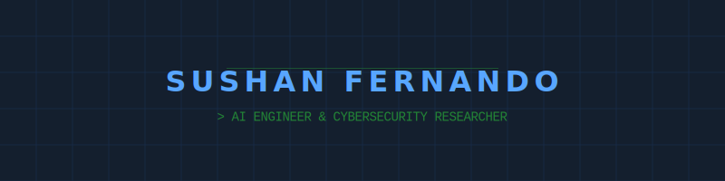
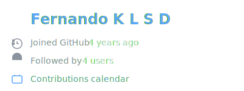
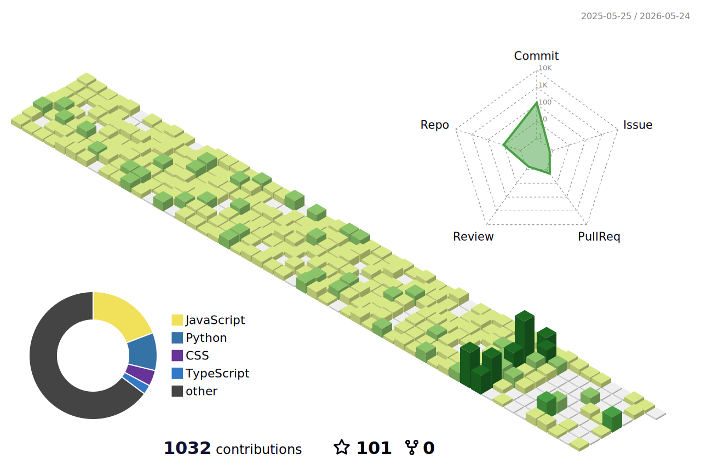
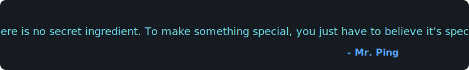

  

  <h1>💫 Sushan Fernando</h1>

  

    
  

  

    
  

---

### 🔭 About Me

I am a passionate technologist focused on **AI model development**, **custom model training**, and the intersection of **Cybersecurity** and **IoT systems**. I strive to build secure, intelligent, and scalable solutions that bridge the gap between software and hardware.

- 👯 **Collaborating on**: Open-source projects involving AI agents, multi-agent systems, ESP32-based IoT solutions, and offensive/defensive security research.
- 🤝 **Looking for help with**: Deepening knowledge in ML model training and hardware-level electronics development.
- 🌱 **Learning currently**: Networking (CCNA), Advanced Cybersecurity, and deep-level ML integration for embedded systems.
- 💬 **Ask me about**: Web development, AI platforms, ESP32/Arduino projects, and ML workflows.

---

### 💻 Tech Stack

| | Skills |
| :--- | :--- |
| **Languages** |  |
| **Frameworks** |  |
| **Infrastructure** |  |
| **Databases** |  |
| **AI / ML** |  |
| **Hardware / Tools** |  |
| **Design** |  |

---

### 📊 GitHub Activity Dashboard

  <table border="0">
    <tr>
      <td width="50%" valign="top">
        
         
        
      </td>
      <td width="50%" valign="top">
        
         
        
      </td>
    </tr>
  </table>
  
   
  
  

    <b>3D Contribution Graph</b> 
    <picture>
      <source media="(prefers-color-scheme: dark)" srcset="./profile-3d-contrib/profile-night-green.svg">
      
    </picture>
  

   

  

    <b>Activity Progression</b> 
    
  

---

### 🌐 Connect with me

  
  
  
  

 

  

